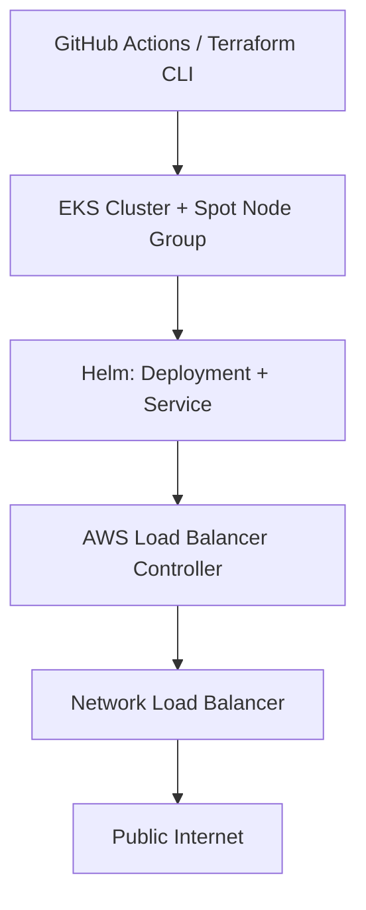

# DevOps Portfolio: Production-Grade AWS Infrastructure, Built Incrementally

A six-part DevOps project, built on AWS one working segment at a time. Each segment stands on its own, and together they build toward a full production-style platform: containerized deployment, secure CI/CD, GitOps promotion across environments, event-driven auto-scaling, and observability.

Every decision below is documented with the reasoning behind it, not just the outcome. The goal is to show how the choices were made, not just that the code runs.

## Roadmap

| Segment | Focus | Status |
|---|---|---|
| 1 | Containerize and deploy a single service. Docker, Terraform, EKS, Helm, NLB | Complete |
| 2 | Secure CI pipeline. GitHub Actions, Gitleaks, Semgrep, Trivy, Checkov, Cosign | Planned |
| 3 | GitOps multi-environment promotion. Argo CD, SIT/UAT/Prod, DAST and load-test gates | Planned |
| 4 | Event-driven auto-scaling. SQS, KEDA, Karpenter, Lambda overflow | Planned |
| 5 | Observability and security operations. Prometheus, Grafana, Loki, DefectDojo | Planned |
| 6 | Capstone: full end-to-end integration across a 3-cluster topology | Planned |

## Segment 1: Containerize and Deploy

What's actually running:

- Terraform provisions the infrastructure using the community `terraform-aws-modules` for VPC and EKS, rather than hand-rolled resources.
- The EKS node group runs on EC2 Spot instances. That's a deliberate cost trade-off for a personal project, explained in `architecture-decisions.md`.
- The service is exposed through a Kubernetes Service and the AWS Load Balancer Controller, which provisions a real Network Load Balancer. An ALB and Ingress would have been overkill here, since there's only one service and no routing rules to justify Layer 7.
- Access is managed through AWS IAM Identity Center, using a scoped permission set (PowerUserAccess plus a narrow custom policy) instead of full admin access. The policy was tightened further during real debugging, using AWS's own Access Troubleshooter to see exactly which ARN was being evaluated.
- ECR scans images on push, image tags are immutable, nodes enforce IMDSv2, and the pods authenticate to AWS through IRSA rather than static credentials.

Full writeup: [`segment1-containerize/architecture-decisions.md`](./segment1-containerize/architecture-decisions.md)
Full runbook: [`segment1-containerize/DEPLOY.md`](./segment1-containerize/DEPLOY.md)

## Why this project is structured this way

A lot of portfolio projects follow a tutorial end to end. This one doesn't. Every non-obvious choice here (Spot vs On-Demand, NLB vs ALB, a scoped permission set vs admin access, EC2 vs Fargate) was made on purpose, and the trade-offs that were rejected are written down too. The `architecture-decisions.md` file in each segment is meant to be read on its own, as the artifact that shows the reasoning, separate from the code.
